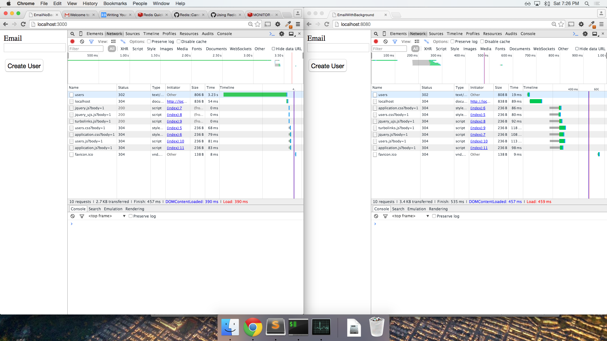

# thunder-talk

A simple experiment with background processes. This repo includes the following:

1. A simple Rails web application that sends an email to the user upon signup without any background process

2. The same Rails web application with a background process to achieve the email delivery

Here we have a side by side network comparison of the same app running with and without using a background process:

Description: The top green bars in both browser windows represent the time required for the request on submit to complete. In the first case, the email notification is not being delegated to a background process hence the delay. In the second case, the email notification is being delegated to a background process therefore the request is no longer being delayed. In the second case, the process was delegated to a worker virtual machine (redis server).
